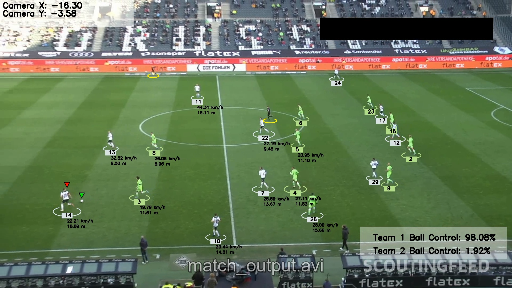

# Football Analytics CV

A full computer vision pipeline that takes a raw football match video and outputs a fully annotated video with player tracking, team detection, ball possession, speed, and distance — all in real-world units.



---

## What It Does

| Feature | Description |
|---|---|
| Player & ball tracking | Every player, referee, and the ball gets a persistent ID across all frames |
| Team assignment | Automatically detects team colors from t-shirts using KMeans clustering |
| Ball possession | Assigns the ball to the nearest player each frame, shows running % per team |
| Camera movement compensation | Optical flow removes camera pan/tilt from player positions |
| Real-world coordinates | Perspective transform converts pixel positions to metres on the pitch |
| Speed & distance | Every player's speed (km/h) and total distance covered (metres) |

---

## Output Example

The output video shows:
- Colored ellipses under each player (color = team)
- Player ID number in a box below each ellipse
- Green triangle above the ball
- Red triangle above the player who has possession
- Speed and distance overlaid under each player
- Camera X/Y movement in top left
- Team ball control % in bottom right

---

## Project Structure

```
football-analytics-cv/
│
├── main.py                          ← entry point, runs full pipeline
├── yolo_inference.py                ← standalone YOLO exploration script
├── requirements.txt
│
├── input_videos/
│   └── your_video.mp4               ← put your match video here
│
├── output_videos/
│   └── output_video.avi             ← annotated output written here
│
├── models/
│   └── best.pt                      ← fine-tuned YOLO weights (download separately)
│
├── stubs/                           ← cached pickle files for fast re-runs
│   ├── track_stubs.pkl
│   └── camera_movement_stub.pkl
│
├── utils/
│   ├── __init__.py
│   ├── video_utils.py               ← read_video(), save_video()
│   └── bbox_utils.py                ← bbox helpers, distance functions
│
├── trackers/
│   ├── __init__.py
│   └── tracker.py                   ← YOLO detection + ByteTrack + drawing
│
├── team_assigner/
│   ├── __init__.py
│   └── team_assigner.py             ← KMeans t-shirt color clustering
│
├── player_ball_assigner/
│   ├── __init__.py
│   └── player_ball_assigner.py      ← nearest player to ball logic
│
├── camera_movement_estimator/
│   ├── __init__.py
│   └── camera_movement_estimator.py ← Lucas-Kanade optical flow
│
├── view_transformer/
│   ├── __init__.py
│   └── view_transformer.py          ← perspective transform → metres
│
├── speed_and_distance_estimator/
│   ├── __init__.py
│   └── speed_and_distance_estimator.py
│
└── football_training/               ← Colab notebook for fine-tuning YOLO
```

---

## Setup

### 1. Clone and enter the project
```bash
git clone https://github.com/yourname/football-analytics-cv.git
cd football-analytics-cv
```

### 2. Create a virtual environment
```bash
python -m venv .venv

# Windows
.venv\Scripts\activate

# Mac/Linux
source .venv/bin/activate
```

### 3. Install dependencies
```bash
pip install -r requirements.txt
```

### 4. Add your files
- Put your match video inside `input_videos/`
- Put `best.pt` inside `models/`
- Update the `video_path` variable in `main.py` to match your video filename

### 5. Run
```bash
python main.py
```

Output will be saved to `output_videos/output_video.avi`

---

## Requirements

```
ultralytics
supervision
opencv-python
numpy
matplotlib
pandas
scikit-learn
roboflow
```

Install all at once:
```bash
pip install -r requirements.txt
```

---

## Model

The tracker uses a custom YOLOv8 model fine-tuned on football footage to detect 4 classes:

| Class | Description |
|---|---|
| `ball` | Football |
| `player` | Outfield players |
| `goalkeeper` | Goalkeeper (merged into player class at runtime) |
| `referee` | Match officials |

The model was trained on the [DFL Bundesliga Data Shootout](https://www.kaggle.com/competitions/dfl-bundesliga-data-shootout) dataset from Kaggle using Roboflow for annotation management.

To use the pre-trained weights, download `best.pt` and place it in the `models/` folder.

---

## How the Pipeline Works

Each stage enriches the `tracks` dictionary with new data. No stage modifies what a previous stage added.

```
read_video()
    │
    ▼
Tracker (YOLO + ByteTrack)
    │  adds → bbox per object per frame
    ▼
TeamAssigner (KMeans)
    │  adds → team, team_color per player
    ▼
PlayerBallAssigner
    │  adds → has_ball per player
    │  produces → team_ball_control array
    ▼
CameraMovementEstimator (Optical Flow)
    │  adds → position_adjusted (camera-corrected pixels)
    ▼
ViewTransformer (Homography)
    │  adds → position_transformed (real-world metres)
    ▼
SpeedAndDistanceEstimator
    │  adds → speed (km/h), distance (metres)
    ▼
draw_annotations() → save_video()
```

---

## Calibrating for a New Video

Speed and distance only work for players inside the calibrated pitch region. If you use a different video with a different camera angle, you must recalibrate the perspective transform.

Run this script to click 4 corners of a known rectangle on the pitch (e.g. the penalty box):

```python
import cv2

cap = cv2.VideoCapture('input_videos/YOUR_VIDEO.mp4')
ret, frame = cap.read()
cap.release()

coords = []

def click(event, x, y, flags, param):
    if event == cv2.EVENT_LBUTTONDOWN:
        coords.append((x, y))
        cv2.circle(frame, (x, y), 6, (0, 0, 255), -1)
        cv2.putText(frame, f"{len(coords)}: ({x},{y})", (x+8, y),
                    cv2.FONT_HERSHEY_SIMPLEX, 0.6, (0, 255, 0), 2)
        cv2.imshow('frame', frame)
        print(f"Point {len(coords)}: ({x}, {y})")
        if len(coords) == 4:
            print("\nCopy these into view_transformer.py:")
            for c in coords:
                print(f"  {c},")

cv2.imshow('frame', frame)
cv2.setMouseCallback('frame', click)
cv2.waitKey(0)
cv2.destroyAllWindows()
```

Click in this order: **bottom-left → top-left → top-right → bottom-right**

Then update `pixel_vertices` and `target_vertices` in `view_transformer/view_transformer.py` with your new values and the real-world dimensions of your chosen rectangle.

Penalty box dimensions for reference: **40.32m wide × 16.5m deep**

---

## Stubs (Speed Up Re-runs)

YOLO detection and camera movement estimation are the slowest steps. After the first run, results are cached as pickle files in `stubs/`. On subsequent runs these are loaded instantly.

If you change the input video, the stubs are automatically invalidated (frame count check) and re-generated. You can also delete them manually:

```bash
del stubs\track_stubs.pkl
del stubs\camera_movement_stub.pkl
```

---

## Known Issues

| Issue | Cause | Fix |
|---|---|---|
| Most players show no speed | Trapezoid not calibrated for this camera | Recalibrate `view_transformer.py` |
| Wrong team colors | KMeans confused by similar kit colors | Adjust `assign_team_color()` in `team_assigner.py` |
| Ball tracking jumpy | Ball occluded or out of frame | Interpolation handles this automatically |
| `IndexError: list index out of range` | Stale stubs from different video | Delete `.pkl` files in `stubs/` |
| 0 frames read | Wrong video path or unsupported codec | Check filename, re-encode to H.264 if needed |

---

## Tech Stack

| Library | Used For |
|---|---|
| `ultralytics` | YOLOv8 object detection |
| `supervision` | ByteTrack multi-object tracking |
| `opencv-python` | Video I/O, drawing, optical flow, perspective transform |
| `numpy` | Array operations |
| `pandas` | Ball position interpolation |
| `scikit-learn` | KMeans clustering for team assignment |